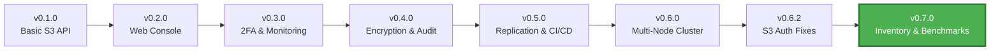

<h1 align="center">Welcome to <span></span> MaxIOFS</h1>

<p align="center">
  <strong>S3-Compatible Object Storage System</strong><br/>
  Single Binary • Modern Web UI • AWS CLI Compatible
</p>

<p align="center">
  <a href="https://github.com/MaxIOFS/MaxIOFS">
    
  </a>
  <a href="https://github.com/MaxIOFS/MaxIOFS">
    
  </a>
  <a href="https://github.com/MaxIOFS/MaxIOFS">
    
  </a>
  <a href="https://github.com/MaxIOFS/MaxIOFS/releases">
    
  </a>
  <a href="https://github.com/MaxIOFS/MaxIOFS">
    
  </a>
</p>

---

## 🎯 What's New in v0.7.0-beta

<table>
<tr>
<td width="50%">

### 📦 Bucket Inventory System
Automated periodic reports in CSV/JSON formats with 12 configurable fields, scheduled generation (daily/weekly), and destination bucket configuration

</td>
<td width="50%">

### 🚀 Benchmarking Suite
Comprehensive Go benchmarks covering storage operations (10KB-10MB) and encryption tasks with `make bench` and CPU profiling support

</td>
</tr>
<tr>
<td width="50%">

### 🔄 Complete Migration Implementation
Full bucket transfers with actual object data, permissions, ACLs, versioning, lifecycle rules, and CORS policies across cluster nodes

</td>
<td width="50%">

### 🔑 AWS-Compatible Access Keys
New keys use AWS format (AKIA prefix + 16 alphanumeric IDs, 40-char base64 secrets). Existing keys remain functional

</td>
</tr>
<tr>
<td width="50%">

### 📦 RPM Package Support
Automated RPM generation in nightly builds alongside Debian packages, supporting AMD64 and ARM64 via Rocky Linux 9

</td>
<td width="50%">

### 🔁 Cluster Synchronization
New background managers for access key syncing (SHA-256 checksums) and bucket permissions across nodes with HMAC auth

</td>
</tr>
</table>

---

## 🚀 About MaxIOFS

MaxIOFS is a **Go-based object storage system** with S3 API compatibility and an embedded React + Vite web interface, designed as a single deployable binary.

**Current Status:** 🟢 Beta (v0.7.0) - suitable for development, testing, staging, and small production workloads.

### 💡 Why MaxIOFS?

<table>
<tr>
<td align="center" width="25%">
<br/>
<h4>🚀 Zero Dependencies</h4>
<p>Single binary deployment - no complex setup, no external dependencies. Just download and run.</p>
</td>
<td align="center" width="25%">
<br/>
<h4>💰 Cost Effective</h4>
<p>Self-hosted S3-compatible storage. Reduce cloud storage costs while maintaining AWS CLI compatibility.</p>
</td>
<td align="center" width="25%">
<br/>
<h4>🔐 Enterprise Ready</h4>
<p>Built-in encryption, 2FA, audit logging, and multi-tenancy. Production-grade security out of the box.</p>
</td>
<td align="center" width="25%">
<br/>
<h4>📈 Scalable</h4>
<p>Start with a single node, scale to multi-node clusters with built-in replication and monitoring.</p>
</td>
</tr>
</table>

---

### ✨ Key Features

#### 🎯 Core Functionality
- ✅ **Full S3 API compatibility** (bucket operations, multipart uploads, presigned URLs)
- ✅ **Single binary deployment** - no external dependencies
- ✅ **AWS CLI compatible** - tested with MinIO Warp stress testing
- ✅ **Docker support** for containerized deployments

#### 🎨 User Interface
- ✅ **Embedded web console** with modern responsive UI
- ✅ **Theme system** with dark/light mode support
- ✅ **Cluster Dashboard UI** for multi-node management

#### 🔐 Security & Authentication
- ✅ **Dual authentication** (JWT for console, S3 Signature v2/v4 for API)
- ✅ **Two-factor authentication (2FA)** with TOTP support
- ✅ **Server-side encryption (SSE-C/SSE-KMS)** with AES-256-CTR
- ✅ **Multi-tenancy** with resource isolation and quotas
- ✅ **Complete audit logging** for compliance tracking

#### 🌐 Enterprise Features
- ✅ **Multi-node cluster infrastructure** with HMAC authentication
- ✅ **Bucket replication system** with S3 protocol support
- ✅ **Production logging infrastructure** with structured logs
- ✅ **Real-time notifications** via Server-Sent Events (SSE)
- ✅ **Bucket notification webhooks** with event filtering
- ✅ **Prometheus monitoring** integration

#### 🔬 Quality Assurance
- ✅ **CI/CD nightly build pipeline** for continuous integration
- ✅ **Extensive test coverage** (Backend: 53% | Frontend: 100%)

---

## 🛠 Technology Stack

<p>
  
</p>

| Technology | Purpose |
|-----------|---------|
| **Go 1.21+** | Core storage engine |
| **React + Vite** | Embedded web console |
| **BadgerDB** | Metadata storage |
| **SQLite** | Authentication database |
| **Filesystem** | Object storage backend |

---

## 🏗 Architecture Overview

### 🔧 Single Binary Design

<table>
<tr>
<td width="50%">

**Core Components**
- 🎯 All-in-one executable with embedded web UI
- 📊 BadgerDB for metadata management
- 🔐 SQLite for user authentication & config
- 💾 Filesystem-based object storage
- ⚡ Atomic write operations with rollback

</td>
<td width="50%">

**Cluster Architecture** *(New in v0.6.0)*
- 🌐 Multi-node cluster support
- 🔄 Cross-node bucket replication
- 🛡️ HMAC-based authentication
- 📊 Centralized cluster dashboard
- 🔗 S3 protocol for inter-node communication

</td>
</tr>
</table>

### ⚡ Performance Benchmarks

| Metric | Performance | Test Details |
|--------|-------------|--------------|
| **Write Speed** | ~374 MB/s | Local filesystem |
| **Read Speed** | ~1703 MB/s | Sequential reads |
| **Stress Test** | 7000+ objects | MinIO Warp testing |
| **Backend Coverage** | 53% | Unit + Integration tests |
| **Frontend Coverage** | 100% | Complete test suite |

---

## 📌 Development Roadmap

### ✅ Completed (v0.1.0 - v0.6.0-beta)

#### Phase 1: Core Foundation
- [x] S3 API compatibility layer
- [x] Web management console
- [x] Multi-tenancy support
- [x] Access key management
- [x] Bucket policies and CORS

#### Phase 2: Security & Monitoring
- [x] Two-factor authentication (2FA)
- [x] Server-side encryption (SSE-C/SSE-KMS)
- [x] Audit logging system
- [x] Prometheus monitoring integration
- [x] Real-time notifications (SSE)
- [x] Bucket notification webhooks

#### Phase 3: Enterprise & Clustering
- [x] Multi-node cluster infrastructure
- [x] Bucket replication system (S3 protocol)
- [x] Cluster Dashboard UI
- [x] Production logging infrastructure
- [x] Theme system (dark/light mode)
- [x] CI/CD nightly build pipeline

### 🚧 In Progress

#### Phase 4: Advanced Enterprise Features
- [ ] Multi-region federation
- [ ] Enhanced IAM policies with RBAC
- [ ] Object lifecycle management
- [ ] Advanced compliance features
- [ ] Cross-cluster bucket replication
- [ ] Geo-replication support

#### Phase 5: Performance & Scalability
- [ ] Object versioning improvements
- [ ] Advanced caching layer
- [ ] Multi-backend support (S3, GCS, Azure)
- [ ] Erasure coding for data durability

---

## 🤝 Contributing

We welcome contributions from the community ❤️

🐞 **Report Issues:** https://github.com/MaxIOFS/MaxIOFS/issues  
🧩 **Feature Requests:** https://github.com/MaxIOFS/MaxIOFS/discussions  
📩 **Contact:** contact@maxiofs.com *(optional)*

---

## 🔗 Resources & Links

<p align="center">
  <a href="https://maxiofs.com">
    
  </a>
  <a href="https://github.com/MaxIOFS/MaxIOFS/blob/main/CHANGELOG.md">
    
  </a>
  <a href="https://github.com/MaxIOFS/MaxIOFS/discussions">
    
  </a>
  <a href="https://github.com/MaxIOFS/MaxIOFS/releases">
    
  </a>
</p>

---

## 🎯 Common Use Cases

<details open>
<summary><b>Development & Testing</b></summary>

Perfect for local development environments needing S3-compatible storage without cloud dependencies.

```bash
# Start MaxIOFS locally
./maxiofs --data-dir ./dev-storage

# Use with AWS CLI
aws --endpoint-url http://localhost:8080 s3 mb s3://my-test-bucket
```
</details>

<details>
<summary><b>CI/CD Pipelines</b></summary>

Integrate with your CI/CD for artifact storage, test data management, and build caching.

```yaml
# GitHub Actions example
- name: Setup MaxIOFS
  run: |
    ./maxiofs --data-dir ./ci-cache &
    aws s3 sync ./build s3://build-artifacts
```
</details>

<details>
<summary><b>Backup & Archive</b></summary>

Self-hosted backup solution with S3 compatibility for existing backup tools.

```bash
# Backup with restic
restic -r s3:http://localhost:8080/backups init
restic backup /important/data
```
</details>

<details>
<summary><b>Backup & Archive Storage</b></summary>

Centralized storage for backups with S3 API compatibility for standard backup tools.

```bash
# Use with popular backup tools
rclone copy /data remote:maxiofs-bucket
duplicity /important s3://localhost:8080/backups
```
</details>

---

## 🚀 Quick Start

**Build Requirements:**
- Go 1.21+
- Node.js 18+

**Build & Run:**
```bash
make build
./build/maxiofs --data-dir ./data
```

**Access:**
- Web Console: http://localhost:8081 (default credentials: admin/admin)
- S3 API Endpoint: http://localhost:8080

**⚠️ Important:** Change default credentials before production use!

---

## 📦 Latest Releases

<details open>
<summary><b>Version 0.7.0-beta</b> (2026-01-16) - Latest Release 🎉</summary>

### Highlights
- 📦 **Bucket Inventory System**: Automated periodic reports in CSV/JSON formats with 12 configurable fields and scheduled generation
- 🚀 **Benchmarking Suite**: Comprehensive Go benchmarks for storage (10KB-10MB) and encryption with CPU profiling
- 🔄 **Complete Migration**: Full bucket transfers with actual object data, permissions, ACLs, and configurations
- 🔑 **AWS-Compatible Access Keys**: New format with AKIA prefix (existing keys remain functional)
- 📦 **RPM Package Support**: Automated RPM generation in nightly builds (AMD64/ARM64)
- 🔁 **Cluster Sync Managers**: Background syncing for access keys and bucket permissions across nodes
- 📊 **Metrics Coverage**: Test coverage expanded from 25.8% to 36.2%
- 🗄️ **Database Migrations**: Framework tracking schema evolution through 8 historical migrations

[View Full Changelog](https://github.com/MaxIOFS/MaxIOFS/blob/main/CHANGELOG.md#070-beta---2026-01-16)
</details>

<details>
<summary><b>Version 0.6.2-beta</b> (2026-01-01)</summary>

### Highlights
- 🔒 **Critical S3 Auth Fixes**: Fixed 4 critical authentication bugs (SigV4 parsing, timestamp validation, ARN generation)
- 📊 **Redesigned Metrics Dashboard**: 5 specialized tabs with standardized MetricCard components
- 🛡️ **Data Loss Prevention**: Debian package configuration preservation during updates
- 🎨 **UI Improvements**: Replaced SweetAlert2 with custom modal components
- ✅ **Test Coverage**: Auth module improved from 30.2% to 47.1%

[View Full Changelog](https://github.com/MaxIOFS/MaxIOFS/blob/main/CHANGELOG.md#062-beta---2026-01-01)
</details>

<details>
<summary><b>Version 0.6.1-beta</b> (2025-12-24)</summary>

### Highlights
- 🧪 **S3 API Test Suite**: Expanded with enhanced compatibility testing
- 🔗 **Server Integration Tests**: Added comprehensive test suite (Sprint 4)
- 🐳 **Docker Infrastructure**: Reorganized with improved Prometheus/Grafana configurations
- 📦 **Frontend Dependencies**: Significant upgrades to latest versions

[View Full Changelog](https://github.com/MaxIOFS/MaxIOFS/blob/main/CHANGELOG.md#061-beta---2025-12-24)
</details>

<details>
<summary><b>Version 0.6.0-beta</b> (2025-12-09)</summary>

### Highlights
- 🌐 **Cluster Bucket Replication System** (Phase 3.3) with HMAC authentication
- 📊 **Cluster Dashboard UI** (Phase 3) for multi-node management
- 🔧 Multi-node cluster infrastructure improvements

[View Full Changelog](https://github.com/MaxIOFS/MaxIOFS/blob/main/CHANGELOG.md#060-beta---2025-12-09)
</details>

---

## ⚠️ Known Limitations (Beta)

**Architecture:**
- ✅ ~~Single-node only~~ → **Multi-node cluster support available!**
- Filesystem backend only (multi-backend support planned)
- Geo-replication not yet implemented

**Security:**
- No third-party security audit performed
- HTTPS recommended for production
- TLS/SSL configuration required for production deployments

**Production Readiness:**
- Suitable for development, testing, staging, and **small production workloads**
- Multi-tenancy and cluster features need extensive production validation
- Object Lock not validated with third-party tools

---

## 📊 Project Stats & Progress

<div align="center">

### 🎉 From v0.1.0 to v0.7.0-beta



### 📈 Development Timeline

| Period | Releases | Major Milestones |
|--------|----------|-----------------|
| **Nov 2025** | v0.4.0 - v0.4.2 | Encryption, Audit Logging, Webhooks |
| **Dec 2025** | v0.5.0 - v0.6.1 | Replication, Clustering, Dashboard, Testing |
| **Jan 2026** | v0.6.2 - v0.7.0 | S3 Auth Fixes, Inventory System, Benchmarking, RPM Packages |
| **Total** | **18+ versions** | **60+ features implemented** |

</div>

---

## 📜 License

MaxIOFS is released under the **MIT License** – use, modify and distribute freely.

---

<div align="center">

### Built with ❤️ by the MaxIOFS Community

<p>
  <strong>🌟 Star the project</strong> ·
  <strong>🐛 Report issues</strong> ·
  <strong>💡 Request features</strong> ·
  <strong>🤝 Contribute code</strong>
</p>

<p>
  <i>Making S3-compatible object storage accessible to everyone</i>
</p>

**[⬆ Back to Top](#)**

</div>
