<h1 align="center">Welcome to <span></span> MaxIOFS</h1>

<p align="center">
  <strong>S3-Compatible Object Storage System</strong><br/>
  Single Binary • Modern Web UI • AWS CLI Compatible
</p>

<p align="center">
  <a href="https://github.com/MaxIOFS/MaxIOFS">
    
  </a>
  <a href="https://github.com/MaxIOFS/MaxIOFS">
    
  </a>
  <a href="https://github.com/MaxIOFS/MaxIOFS">
    
  </a>
  <a href="https://github.com/MaxIOFS/MaxIOFS/releases">
    
  </a>
  <a href="https://github.com/MaxIOFS/MaxIOFS">
    
  </a>
</p>

---

## 🎯 What's New in v1.0.0-beta

<table>
<tr>
<td width="50%">

### 🗄️ Pebble Storage Engine
Replaced BadgerDB with CockroachDB's Pebble (LSM-tree, crash-safe WAL). Fixes recurring metadata corruption on power loss or process kill. Transparent auto-migration on first startup — no action needed.

</td>
<td width="50%">

### 🔑 Identity Provider System
Full LDAP/AD and OAuth2/OIDC (Google, Microsoft) SSO with auto-provisioning, group-to-role mappings, per-tenant isolation, and a built-in LDAP directory browser for bulk user import.

</td>
</tr>
<tr>
<td width="50%">

### 🛡️ Object Integrity Verification
Background scrubber re-reads every object every 24 hours and compares the computed MD5 against the stored ETag. Corruption triggers an SSE notification, email alert, and audit log entry automatically.

</td>
<td width="50%">

### 🔐 Inter-node TLS Encryption
All cluster communication is now automatically encrypted using auto-generated internal certificates (ECDSA P-256 CA, 1-year node certs). Background renewal with hot-swap — no restart or configuration required.

</td>
</tr>
<tr>
<td width="50%">

### 📧 SMTP Email Alert System
Complete email infrastructure with configurable TLS modes (none / STARTTLS / SSL). Disk space, tenant quota, and data corruption alerts auto-resolve in the admin UI when conditions clear — no manual dismissal.

</td>
<td width="50%">

### 🌐 S3 Virtual-Hosted Style + Veeam
Virtual-hosted-style addressing (`bucket.s3.example.com`) now works alongside path-style. Fully tested and compatible with Veeam Backup & Replication, WinSCP, CyberDuck, and CloudBerry.

</td>
</tr>
</table>

---

## 🚀 About MaxIOFS

MaxIOFS is a **Go-based object storage system** with S3 API compatibility and an embedded React + Vite web interface, designed as a single deployable binary.

**Current Status:** 🟢 Beta (v1.0.0) - suitable for development, testing, staging, and small production workloads.

### 💡 Why MaxIOFS?

<table>
<tr>
<td align="center" width="25%">
<br/>
<h4>🚀 Zero Dependencies</h4>
<p>Single binary deployment - no complex setup, no external dependencies. Just download and run.</p>
</td>
<td align="center" width="25%">
<br/>
<h4>💰 Cost Effective</h4>
<p>Self-hosted S3-compatible storage. Reduce cloud storage costs while maintaining AWS CLI compatibility.</p>
</td>
<td align="center" width="25%">
<br/>
<h4>🔐 Enterprise Ready</h4>
<p>Built-in encryption, 2FA, SSO, audit logging, and multi-tenancy. Production-grade security out of the box.</p>
</td>
<td align="center" width="25%">
<br/>
<h4>📈 Scalable</h4>
<p>Start with a single node, scale to multi-node clusters with built-in replication and monitoring.</p>
</td>
</tr>
</table>

---

### ✨ Key Features

#### 🎯 Core Functionality
- ✅ **Full S3 API compatibility** (bucket operations, multipart uploads, presigned URLs)
- ✅ **Virtual-hosted-style S3 addressing** (`bucket.s3.example.com`) alongside path-style
- ✅ **Single binary deployment** - no external dependencies
- ✅ **AWS CLI compatible** - tested with MinIO Warp stress testing and Veeam
- ✅ **Docker support** for containerized deployments

#### 🎨 User Interface
- ✅ **Embedded web console** with modern responsive UI
- ✅ **Theme system** with dark/light mode support
- ✅ **Cluster Dashboard UI** for multi-node management
- ✅ **Maintenance mode banner** — visible across all pages when active
- ✅ **Background task progress bar** for long-running operations (bulk delete, scrub)
- ✅ **Internationalization (i18n)** — en, es, pt, de, fr with per-page translation files

#### 🔐 Security & Authentication
- ✅ **Dual authentication** (JWT for console, S3 Signature v2/v4 for API)
- ✅ **Two-factor authentication (2FA)** with TOTP support
- ✅ **Server-side encryption (SSE)** with AES-256-CTR
- ✅ **Identity Provider System** — LDAP/AD and OAuth2/OIDC (Google, Microsoft) SSO
- ✅ **Group-to-role mappings** with auto-provisioning for external users
- ✅ **Multi-tenancy** with resource isolation and quotas
- ✅ **Complete audit logging** for compliance tracking

#### 🌐 Enterprise Features
- ✅ **Multi-node cluster infrastructure** with automatic inter-node TLS encryption
- ✅ **Bucket replication system** with S3 protocol support
- ✅ **Object integrity verification** — background scrubber with corruption alerting
- ✅ **SMTP email alert system** — disk, quota, and corruption notifications
- ✅ **Maintenance mode enforcement** — write-blocking with admin lockout prevention
- ✅ **Production logging infrastructure** — external syslog (RFC 5424/TLS) and HTTP targets
- ✅ **Real-time notifications** via Server-Sent Events (SSE) with auto-resolution
- ✅ **Bucket notification webhooks** with event filtering
- ✅ **Prometheus monitoring** integration

#### 🔬 Quality Assurance
- ✅ **CI/CD nightly build pipeline** for continuous integration
- ✅ **Extensive test coverage** (Backend: 53% | Frontend: 100%)

---

## 🛠 Technology Stack

<p>
  
</p>

| Technology | Purpose |
|-----------|---------|
| **Go 1.25+** | Core storage engine |
| **React + Vite** | Embedded web console |
| **Pebble** | Metadata storage (CockroachDB LSM-tree engine) |
| **SQLite** | Authentication database |
| **Filesystem** | Object storage backend |

---

## 🏗 Architecture Overview

### 🔧 Single Binary Design

<table>
<tr>
<td width="50%">

**Core Components**
- 🎯 All-in-one executable with embedded web UI
- 📊 Pebble for crash-safe metadata management
- 🔐 SQLite for user authentication & config
- 💾 Filesystem-based object storage
- ⚡ Atomic write operations with rollback
- 🔑 Identity Provider (LDAP/OAuth2 SSO)
- 📧 SMTP email alert system

</td>
<td width="50%">

**Cluster Architecture** *(New in v0.6.0)*
- 🌐 Multi-node cluster support
- 🔄 Cross-node bucket replication
- 🔐 Automatic inter-node TLS encryption *(v0.9.1)*
- 🛡️ HMAC-based authentication
- 📊 Centralized cluster dashboard
- 🔗 S3 protocol for inter-node communication

</td>
</tr>
</table>

### ⚡ Performance Benchmarks

| Metric | Performance | Test Details |
|--------|-------------|--------------|
| **Write Speed** | ~374 MB/s | Local filesystem |
| **Read Speed** | ~1703 MB/s | Sequential reads |
| **Stress Test** | 7000+ objects | MinIO Warp testing |
| **Backend Coverage** | 53% | Unit + Integration tests |
| **Frontend Coverage** | 100% | Complete test suite |

---

## 📌 Development Roadmap

### ✅ Completed (v0.1.0 - v1.0.0-beta)

#### Phase 1: Core Foundation
- [x] S3 API compatibility layer
- [x] Web management console
- [x] Multi-tenancy support
- [x] Access key management
- [x] Bucket policies and CORS

#### Phase 2: Security & Monitoring
- [x] Two-factor authentication (2FA)
- [x] Server-side encryption (SSE-C/SSE-KMS)
- [x] Audit logging system
- [x] Prometheus monitoring integration
- [x] Real-time notifications (SSE)
- [x] Bucket notification webhooks

#### Phase 3: Enterprise & Clustering
- [x] Multi-node cluster infrastructure
- [x] Bucket replication system (S3 protocol)
- [x] Cluster Dashboard UI
- [x] Production logging infrastructure
- [x] Theme system (dark/light mode)
- [x] CI/CD nightly build pipeline

#### Phase 4: Advanced Clustering & Testing (v0.6.x)
- [x] Cross-cluster bucket replication with HMAC auth
- [x] Automatic tenant synchronization (30s intervals)
- [x] Bucket location cache (5-min TTL, 5ms latency)
- [x] S3 API comprehensive test suite (80+ test cases)
- [x] Server integration tests
- [x] Critical S3 authentication fixes (SigV4/V2)
- [x] Docker infrastructure improvements
- [x] Frontend dependencies optimization (SweetAlert2 removal)
- [x] Debian package config preservation

#### Phase 5: Inventory, Benchmarks & Migrations (v0.7.0)
- [x] Bucket Inventory System (CSV/JSON, daily/weekly schedules)
- [x] Go benchmarking suite (12 storage + 13 encryption benchmarks)
- [x] Complete bucket migration with actual object data
- [x] AWS-compatible access key format (AKIA prefix)
- [x] RPM package support (AMD64/ARM64)
- [x] Access key cluster synchronization (SHA-256 checksums)
- [x] Bucket permissions cluster synchronization
- [x] Database migration framework (8 migrations tracked)

#### Phase 6: Security Hardening & Enterprise Features (v0.8.0)
- [x] Object Filters & Advanced Search (content-type, size, date, tags)
- [x] Complete Bucket Policy enforcement engine (AWS-compatible)
- [x] Presigned URL signature validation (SigV4 + V2)
- [x] Cluster join functionality with multi-step protocol
- [x] Cross-node bucket and quota aggregation
- [x] Rate limiting (token bucket, 100 req/s) and circuit breakers
- [x] Version check notification in the admin sidebar

#### Phase 7: Identity Providers & SSO (v0.9.0)
- [x] LDAP/AD identity provider with TLS/StartTLS and AD attribute mapping
- [x] OAuth2/OIDC with Google and Microsoft presets
- [x] Auto-provisioning from group mappings with role resolution
- [x] LDAP directory browser and bulk user import
- [x] SSO login buttons on the login page
- [x] Tombstone-based cluster deletion sync (entity resurrection fix)
- [x] JWT secret persistence and cluster-wide synchronization
- [x] Per-tenant IDP isolation

#### Phase 8: Cluster TLS & External Logging (v0.9.1)
- [x] Automatic inter-node TLS with auto-generated internal CA
- [x] Background certificate renewal with hot-swap (no restart)
- [x] External syslog targets (RFC 5424, TCP+TLS, mTLS, custom CA)
- [x] External HTTP logging targets with N-target support
- [x] Cluster Join UI for standalone nodes
- [x] Cluster token display modal with copy-to-clipboard

#### Phase 9: Stability, Integrity & Compatibility (v1.0.0-beta)
- [x] Pebble engine replacing BadgerDB (crash-safe WAL, transparent migration)
- [x] Object integrity verification with background scrubber (24h cycle)
- [x] Maintenance mode enforcement (S3 write-blocking, admin-safe exemptions)
- [x] SMTP email alert system with explicit TLS modes
- [x] Disk space and tenant quota alerts with SSE auto-resolution
- [x] Virtual-hosted-style S3 addressing (Veeam, CyberDuck, WinSCP compatibility)
- [x] Frontend code splitting with React.lazy (main bundle −45%, 1003 kB → 550 kB)
- [x] Frontend internationalization (en, es, pt, de, fr per-page JSON files)
- [x] Multipart upload 5-bug fix (race, I/O waste, flusher, context cancellation)
- [x] Bucket ACL cross-scope isolation and orphan cleanup on user deletion
- [x] Audit log for automatic account locks and object operations
- [x] Background stats reconciler (15-min cycle, auto-corrects bucket counters)

### 🚧 Planned

#### Phase 10: Advanced Federation & Backends
- [ ] Multi-region federation
- [ ] Enhanced IAM policies with RBAC
- [ ] Advanced compliance features
- [ ] Geo-replication support

#### Phase 11: Performance & Scalability
- [ ] Multi-backend support (S3, GCS, Azure)
- [ ] Erasure coding for data durability

---

## 🤝 Contributing

We welcome contributions from the community ❤️

🐞 **Report Issues:** https://github.com/MaxIOFS/MaxIOFS/issues
🧩 **Feature Requests:** https://github.com/MaxIOFS/MaxIOFS/discussions
📩 **Contact:** contact@maxiofs.com *(optional)*

---

## 🔗 Resources & Links

<p align="center">
  <a href="https://maxiofs.com">
    
  </a>
  <a href="https://github.com/MaxIOFS/MaxIOFS/blob/main/CHANGELOG.md">
    
  </a>
  <a href="https://github.com/MaxIOFS/MaxIOFS/discussions">
    
  </a>
  <a href="https://github.com/MaxIOFS/MaxIOFS/releases">
    
  </a>
</p>

---

## 🎯 Common Use Cases

<details open>
<summary><b>Development & Testing</b></summary>

Perfect for local development environments needing S3-compatible storage without cloud dependencies.

```bash
# Start MaxIOFS locally
./maxiofs --data-dir ./dev-storage

# Use with AWS CLI
aws --endpoint-url http://localhost:8080 s3 mb s3://my-test-bucket
```
</details>

<details>
<summary><b>CI/CD Pipelines</b></summary>

Integrate with your CI/CD for artifact storage, test data management, and build caching.

```yaml
# GitHub Actions example
- name: Setup MaxIOFS
  run: |
    ./maxiofs --data-dir ./ci-cache &
    aws s3 sync ./build s3://build-artifacts
```
</details>

<details>
<summary><b>Backup & Archive</b></summary>

Self-hosted backup solution with S3 compatibility for existing backup tools.

```bash
# Backup with restic
restic -r s3:http://localhost:8080/backups init
restic backup /important/data
```
</details>

---

## 🚀 Quick Start

**Build Requirements:**
- Go 1.25+
- Node.js 24.10+

**Build & Run:**
```bash
make build
./build/maxiofs --data-dir ./data
```

**Access:**
- Web Console: http://localhost:8081 (default credentials: admin/admin)
- S3 API Endpoint: http://localhost:8080

**⚠️ Important:** Change default credentials before production use!

---

## 📦 Latest Releases

<details open>
<summary><b>Version 1.0.0-beta</b> (2026-03-02) - Latest Release 🎉</summary>

### Highlights
- 🗄️ **Pebble Engine**: Replaced BadgerDB with CockroachDB's Pebble. Crash-safe WAL, transparent auto-migration, fixes recurring metadata corruption on power loss.
- 🛡️ **Object Integrity Verification**: Background scrubber scans all objects every 24h with on-demand endpoint. Corruption triggers SSE + email + audit log automatically.
- 🔧 **Maintenance Mode Enforcement**: Blocks all write operations (S3 + Console API) while preserving read access. Admin-safe exemptions prevent lockout.
- 📧 **SMTP Email Alerts**: Full email infrastructure — disk space, tenant quota, and corruption alerts. Condition-based notifications auto-resolve in the UI when cleared.
- 🌐 **Virtual-Hosted-Style S3**: `bucket.s3.example.com` addressing now works. Confirmed Veeam, WinSCP, CyberDuck, and CloudBerry compatibility.
- ⚡ **Frontend Code Splitting**: Main bundle reduced from 1,003 kB → 550 kB (−45%) via `React.lazy`. Charts (recharts, 383 kB) only load on the Metrics page.
- 🌍 **i18n Expansion**: All cluster, metrics, bucket, and settings pages fully translated in en/es/pt/de/fr with per-page JSON files.
- 🔧 **Multipart Upload**: 5 cascading bugs fixed (error mismatch, Windows rename race, 3× I/O waste, Flusher propagation, context cancellation).

[View Full Changelog](https://github.com/MaxIOFS/MaxIOFS/blob/main/CHANGELOG.md#100-beta---2026-03-02)
</details>

<details>
<summary><b>Version 0.9.1-beta</b> (2026-02-22)</summary>

### Highlights
- 🔐 **Inter-node TLS Encryption**: All cluster communication automatically encrypted with auto-generated internal CA. Background cert renewal with hot-swap.
- 📡 **External Logging Targets**: N-target syslog (RFC 5424, TCP+TLS, mTLS) and HTTP log forwarding stored in SQLite with full CRUD API.
- 🔗 **Cluster Join UI**: Standalone nodes now have a "Join Existing Cluster" button with form-based workflow.
- 🛡️ **Critical Security Fixes**: IDP tenant isolation, user/access key/bucket permission handler auth gaps, cluster self-deletion prevention.
- ✅ **Veeam Backup & Replication**: Fully tested and operational.

[View Full Changelog](https://github.com/MaxIOFS/MaxIOFS/blob/main/CHANGELOG.md#091-beta---2026-02-22)
</details>

<details>
<summary><b>Version 0.9.0-beta</b> (2026-02-17)</summary>

### Highlights
- 🔑 **Identity Provider System**: LDAP/AD and OAuth2/OIDC (Google, Microsoft) SSO with auto-provisioning, group-to-role mappings, and LDAP directory browser.
- 🔒 **Critical Security Fixes**: JWT signed with wrong key (empty string default), CORS wildcard, rate-limit IP spoofing, XSS via `dangerouslySetInnerHTML`.
- 🪦 **Tombstone Deletion Sync**: Prevents entity resurrection in cluster after bidirectional sync.
- 🔑 **JWT Secret Persistence**: Secret persists across restarts and syncs to all cluster nodes on join.

[View Full Changelog](https://github.com/MaxIOFS/MaxIOFS/blob/main/CHANGELOG.md#090-beta---2026-02-17)
</details>

<details>
<summary><b>Version 0.8.0-beta</b> (2026-02-07)</summary>

### Highlights
- 🔍 **Object Filters & Advanced Search**: Content-type, size range, date range, and tag filters with server-side evaluation.
- 📋 **Bucket Policy Enforcement**: Complete AWS S3-compatible policy evaluation (Default Deny → Allow → Explicit Deny).
- 🌐 **Cluster Join**: Multi-step join protocol for dynamic cluster expansion.
- 🛡️ **Production Hardening**: Rate limiting (100 req/s token bucket) and circuit breakers across cluster aggregators.
- 🔔 **Version Check Notification**: Admins see a badge when a new release is available.

[View Full Changelog](https://github.com/MaxIOFS/MaxIOFS/blob/main/CHANGELOG.md#080-beta---2026-02-07)
</details>

<details>
<summary><b>Version 0.7.0-beta</b> (2026-01-16)</summary>

### Highlights
- 📦 **Bucket Inventory System**: Automated periodic reports in CSV/JSON formats with 12 configurable fields and scheduled generation
- 🚀 **Benchmarking Suite**: Comprehensive Go benchmarks for storage (10KB-10MB) and encryption with CPU profiling
- 🔄 **Complete Migration**: Full bucket transfers with actual object data, permissions, ACLs, and configurations
- 🔑 **AWS-Compatible Access Keys**: New format with AKIA prefix (existing keys remain functional)
- 📦 **RPM Package Support**: Automated RPM generation in nightly builds (AMD64/ARM64)
- 🔁 **Cluster Sync Managers**: Background syncing for access keys and bucket permissions across nodes
- 📊 **Metrics Coverage**: Test coverage expanded from 25.8% to 36.2%
- 🗄️ **Database Migrations**: Framework tracking schema evolution through 8 historical migrations

[View Full Changelog](https://github.com/MaxIOFS/MaxIOFS/blob/main/CHANGELOG.md#070-beta---2026-01-16)
</details>

<details>
<summary><b>Version 0.6.2-beta</b> (2026-01-01)</summary>

### Highlights
- 🔒 **Critical S3 Auth Fixes**: Fixed 4 critical authentication bugs (SigV4 parsing, timestamp validation, ARN generation)
- 📊 **Redesigned Metrics Dashboard**: 5 specialized tabs with standardized MetricCard components
- 🛡️ **Data Loss Prevention**: Debian package configuration preservation during updates
- 🎨 **UI Improvements**: Replaced SweetAlert2 with custom modal components
- ✅ **Test Coverage**: Auth module improved from 30.2% to 47.1%

[View Full Changelog](https://github.com/MaxIOFS/MaxIOFS/blob/main/CHANGELOG.md#062-beta---2026-01-01)
</details>

<details>
<summary><b>Version 0.6.1-beta</b> (2025-12-24)</summary>

### Highlights
- 🧪 **S3 API Test Suite**: Expanded with enhanced compatibility testing
- 🔗 **Server Integration Tests**: Added comprehensive test suite (Sprint 4)
- 🐳 **Docker Infrastructure**: Reorganized with improved Prometheus/Grafana configurations
- 📦 **Frontend Dependencies**: Significant upgrades to latest versions

[View Full Changelog](https://github.com/MaxIOFS/MaxIOFS/blob/main/CHANGELOG.md#061-beta---2025-12-24)
</details>

<details>
<summary><b>Version 0.6.0-beta</b> (2025-12-09)</summary>

### Highlights
- 🌐 **Cluster Bucket Replication System** (Phase 3.3) with HMAC authentication
- 📊 **Cluster Dashboard UI** (Phase 3) for multi-node management
- 🔧 Multi-node cluster infrastructure improvements

[View Full Changelog](https://github.com/MaxIOFS/MaxIOFS/blob/main/CHANGELOG.md#060-beta---2025-12-09)
</details>

---

## ⚠️ Known Limitations (Beta)

**Architecture:**
- ✅ ~~Single-node only~~ → **Multi-node cluster support available!**
- ✅ ~~Inter-node communication unencrypted~~ → **Automatic TLS since v0.9.1!**
- Filesystem backend only (multi-backend support planned)
- Geo-replication not yet implemented

**Security:**
- No third-party security audit performed
- HTTPS recommended for production (console and S3 endpoints)

**Production Readiness:**
- Suitable for development, testing, staging, and **small production workloads**
- Multi-tenancy and cluster features need extensive production validation
- Object Lock not validated with third-party tools

---

## 📊 Project Stats & Progress

<div align="center">

### 🎉 From v0.1.0 to v1.0.0-beta

```mermaid
graph LR
    A[v0.1.0<br/>Basic S3 API] --> B[v0.2.0<br/>Web Console]
    B --> C[v0.3.0<br/>2FA & Monitoring]
    C --> D[v0.4.0<br/>Encryption & Audit]
    D --> E[v0.5.0<br/>Replication & CI/CD]
    E --> F[v0.6.0<br/>Multi-Node Cluster]
    F --> G[v0.7.0<br/>Inventory & Benchmarks]
    G --> H[v0.8.0<br/>Security & Search]
    H --> I[v0.9.0<br/>SSO & IDPs]
    I --> J[v0.9.1<br/>Cluster TLS]
    J --> K[v1.0.0<br/>Pebble & Integrity]

    style K fill:#4CAF50,stroke:#2E7D32,stroke-width:3px,color:#fff
```



### 📈 Development Timeline

| Period | Releases | Major Milestones |
|--------|----------|-----------------|
| **Nov 2025** | v0.4.0 - v0.4.2 | Encryption, Audit Logging, Webhooks |
| **Dec 2025** | v0.5.0 - v0.6.1 | Replication, Clustering, Dashboard, Testing |
| **Jan 2026** | v0.6.2 - v0.7.0 | S3 Auth Fixes, Inventory System, Benchmarking, RPM Packages |
| **Feb 2026** | v0.8.0 - v0.9.1 | Security Hardening, SSO/IDPs, Cluster TLS, External Logging |
| **Mar 2026** | v1.0.0-beta | Pebble Engine, Object Integrity, Email Alerts, Maintenance Mode |
| **Total** | **20+ versions** | **100+ features implemented** |

</div>

---

## 📜 License

MaxIOFS is released under the **MIT License** – use, modify and distribute freely.

---

<div align="center">

### Built with ❤️ by the MaxIOFS Community

<p>
  <strong>🌟 Star the project</strong> ·
  <strong>🐛 Report issues</strong> ·
  <strong>💡 Request features</strong> ·
  <strong>🤝 Contribute code</strong>
</p>

<p>
  <i>Making S3-compatible object storage accessible to everyone</i>
</p>

**[⬆ Back to Top](#)**

</div>
