<h1 align="center">Welcome to <span></span> MaxIOFS</h1>

<p align="center">
  <strong>S3-Compatible Object Storage System</strong><br/>
  Single Binary • Modern Web UI • AWS CLI Compatible
</p>

<p align="center">
  <a href="https://github.com/MaxIOFS/MaxIOFS">
    
  </a>
  <a href="https://github.com/MaxIOFS/MaxIOFS">
    
  </a>
  <a href="https://github.com/MaxIOFS/MaxIOFS">
    
  </a>
  <a href="https://github.com/MaxIOFS/MaxIOFS/releases/tag/v1.4.0">
    
  </a>
  <a href="https://github.com/MaxIOFS/MaxIOFS">
    
  </a>
</p>

---

## 🎯 What's New in v1.4.0 (stable)

<table>
<tr>
<td width="50%">

### 🔑 Role capabilities system
Service-level permission matrix stored in the database. 11 fine-grained capabilities (`bucket:create`, `object:upload`, `console:access`, etc.) with role defaults and per-user overrides. Enforced across all S3 and console API handlers. Admin UI for managing permissions per-user and per-role.

</td>
<td width="50%">

### 🛡️ 50+ bug fixes — versioning, metadata & S3 parity
Critical fixes: version IDs preserved in HA replication, `versionId` honored in tagging/ACL/lock/restore operations, `ListObjectsV2 KeyCount` includes common prefixes, multipart upload stores no request headers as metadata (security fix), filesystem writes are now atomic at metadata and data level.

</td>
</tr>
<tr>
<td width="50%">

### 🔒 Security hardening
Presigned V4 URLs now enforce signed headers and expiration limits. `CopyObject` goes through full source-read + destination-write authorization. Filesystem path traversal fix for Windows separators. `console:access` revocation takes effect immediately on existing tokens.

</td>
<td width="50%">

### 🐛 Additional reliability fixes
Replication queue deduplication (no more duplicate remote PUTs). Inventory report uploads are now atomic (storage before metadata). Multipart listing pagination truncation and markers corrected. Session refresh no longer treats background token calls as user activity (see [changelog](https://github.com/MaxIOFS/MaxIOFS/blob/main/CHANGELOG.md#140---2026-05-03)).

</td>
</tr>
</table>

## 🎯 What's New in v1.3.0

<table>
<tr>
<td width="50%">

### 🌐 HA write quorum & read fallback
Writes now block until `ceil(factor/2)` replicas acknowledge. Failed quorum returns HTTP 503 with `Retry-After`. Read requests retry across all healthy replicas sorted by latency, with automatic node flipping to `Unavailable` on failures.

</td>
<td width="50%">

### 🔄 Anti-entropy scrubber
Background reconciliation across all HA replicas (configurable cycle, default 24 h). Last-Writer-Wins per object with crash-safe checkpoint in Pebble. Throttled comparisons, per-run history in SQLite, status exposed via admin API.

</td>
</tr>
<tr>
<td width="50%">

### 💀 Dead-node redistribution & storage pressure
Nodes permanently offline beyond threshold are flipped to `dead` state with last-survivor protection. New `storage_pressure` health state excludes high-disk nodes from writes while keeping them for reads. All thresholds are live-reloadable config keys.

</td>
<td width="50%">

### 🔧 Cluster infrastructure overhaul
Dedicated inter-node port 8082. Realtime replication mode now functional. Stale-node reconciler for safe catch-up after partitions. Inter-node S3 proxy with HMAC auth and replay-attack protection. Critical fixes: sync tables never created, TLS cert SAN mismatch, cluster join broken in production (see [changelog](https://github.com/MaxIOFS/MaxIOFS/blob/main/CHANGELOG.md#130---2026-04-21)).

</td>
</tr>
</table>

---

## 🚀 About MaxIOFS

MaxIOFS is a **Go-based object storage system** with S3 API compatibility and an embedded React + Vite web interface, designed as a single deployable binary.

**Current Status:** 🟢 **Stable (v1.4.0)** — suitable for production up to mid-range scale (single node to 5-node cluster); see [known limitations](https://github.com/MaxIOFS/MaxIOFS#known-limitations) in the main repository.

### 💡 Why MaxIOFS?

<table>
<tr>
<td align="center" width="25%">
<br/>
<h4>🚀 Zero Dependencies</h4>
<p>Single binary deployment - no complex setup, no external dependencies. Just download and run.</p>
</td>
<td align="center" width="25%">
<br/>
<h4>💰 Cost Effective</h4>
<p>Self-hosted S3-compatible storage. Reduce cloud storage costs while maintaining AWS CLI compatibility.</p>
</td>
<td align="center" width="25%">
<br/>
<h4>🔐 Enterprise Ready</h4>
<p>Built-in encryption, 2FA, SSO, audit logging, and multi-tenancy. Production-grade security out of the box.</p>
</td>
<td align="center" width="25%">
<br/>
<h4>📈 Scalable</h4>
<p>Start with a single node, scale to multi-node clusters with built-in replication and monitoring.</p>
</td>
</tr>
</table>

---

### ✨ Key Features

#### 🎯 Core Functionality
- ✅ **Full S3 API compatibility** (bucket operations, multipart uploads, presigned URLs)
- ✅ **Virtual-hosted-style S3 addressing** (`bucket.s3.example.com`) alongside path-style
- ✅ **Single binary deployment** - no external dependencies
- ✅ **AWS CLI compatible** - tested with MinIO Warp stress testing and Veeam
- ✅ **Docker support** for containerized deployments

#### 🎨 User Interface
- ✅ **Embedded web console** with modern responsive UI (S3-style bucket browser, object detail view, Actions toolbar)
- ✅ **Theme system** with dark/light mode support
- ✅ **Cluster Dashboard UI** for multi-node management
- ✅ **Version browser** — Show Versions toggle with restore and delete-marker flows when versioning is on
- ✅ **Maintenance mode banner** — visible across all pages when active
- ✅ **Background task progress bar** for long-running operations (bulk delete, scrub)
- ✅ **Internationalization (i18n)** — en, es, pt, de, fr with per-page translation files

#### 🔐 Security & Authentication
- ✅ **Dual authentication** (JWT for console, S3 Signature v2/v4 for API)
- ✅ **Two-factor authentication (2FA)** with TOTP support
- ✅ **Server-side encryption (SSE-S3)** — AES-256-GCM at rest (64 KB chunks, authenticated)
- ✅ **Identity Provider System** — LDAP/AD and OAuth2/OIDC (Google, Microsoft) SSO
- ✅ **Group-to-role mappings** with auto-provisioning for external users
- ✅ **Role capabilities system** — 11 service-level permissions with role defaults and per-user overrides, enforced across S3 and console APIs
- ✅ **Multi-tenancy** with resource isolation and quotas
- ✅ **Complete audit logging** for compliance tracking

#### 🌐 Enterprise Features
- ✅ **Multi-node cluster infrastructure** with automatic inter-node TLS encryption (dedicated inter-node port 8082)
- ✅ **HA write quorum** — writes acknowledged by `ceil(factor/2)` replicas; HTTP 503 on quorum failure with automatic local rollback
- ✅ **HA read fallback** — ordered retry across all healthy replicas sorted by latency
- ✅ **Anti-entropy scrubber** — continuous background reconciliation across HA replicas with Last-Writer-Wins and crash-safe checkpoint
- ✅ **Dead-node redistribution** — automatic removal of permanently offline nodes from write paths, with last-survivor protection
- ✅ **Storage-pressure health state** — high-disk nodes excluded from writes, still serve reads
- ✅ **Stale-node reconciler** — safe LWW catch-up when a partitioned node rejoins
- ✅ **Bucket replication system** with S3 protocol support (AWS S3, MinIO, other MaxIOFS nodes) — realtime mode now functional
- ✅ **S3 Select** (`SelectObjectContent`), **RestoreObject**, **OwnershipControls**, **BucketInventory** & **BucketLogging** APIs
- ✅ **Object integrity verification** — background scrubber with corruption alerting
- ✅ **SMTP email alert system** — disk, quota, and corruption notifications
- ✅ **Maintenance mode enforcement** — write-blocking with admin lockout prevention
- ✅ **Production logging infrastructure** — external syslog (RFC 5424/TLS) and HTTP targets
- ✅ **Real-time notifications** via Server-Sent Events (SSE) with auto-resolution
- ✅ **Bucket notification webhooks** with event filtering
- ✅ **Prometheus monitoring** integration

#### 🔬 Quality Assurance
- ✅ **CI/CD nightly build pipeline** for continuous integration
- ✅ **Large automated test suite** — 3,800+ Go tests, 95+ frontend tests (see [main README](https://github.com/MaxIOFS/MaxIOFS#testing))

---

## 🛠 Technology Stack

<p>
  
</p>

| Technology | Purpose |
|-----------|---------|
| **Go 1.26+** | Core storage engine |
| **React + Vite** | Embedded web console |
| **Pebble** | Metadata storage (CockroachDB LSM-tree engine) |
| **SQLite** | Authentication database |
| **Filesystem** | Object storage backend |

---

## 🏗 Architecture Overview

### 🔧 Single Binary Design

<table>
<tr>
<td width="50%">

**Core Components**
- 🎯 All-in-one executable with embedded web UI
- 📊 Pebble for crash-safe metadata management
- 🔐 SQLite for user authentication & config
- 💾 Filesystem-based object storage
- ⚡ Atomic write operations with rollback
- 🔑 Identity Provider (LDAP/OAuth2 SSO)
- 📧 SMTP email alert system

</td>
<td width="50%">

**Cluster Architecture** *(New in v0.6.0)*
- 🌐 Multi-node cluster support
- 🔄 Cross-node bucket replication
- 🔐 Automatic inter-node TLS encryption *(v0.9.1)*
- 🛡️ HMAC-based authentication
- 📊 Centralized cluster dashboard
- 🔗 S3 protocol for inter-node communication

</td>
</tr>
</table>

### ⚡ Performance & benchmarks

| Metric | Result | Notes |
|--------|--------|-------|
| **PUT p95** | &lt; 10 ms | MinIO Warp, single node, 50 clients |
| **GET p95** | &lt; 13 ms | 100 clients |
| **Success rate** | &gt; 99.99% | Mixed load |
| **Tests** | 3,800+ backend · 95+ frontend | `go test ./...` · `npm run test` |

See [PERFORMANCE.md](https://github.com/MaxIOFS/MaxIOFS/blob/main/docs/PERFORMANCE.md) for full methodology.

---

## 📌 Development Roadmap

### ✅ Completed (v0.1.0 – v1.2.0)

#### Phase 1: Core Foundation
- [x] S3 API compatibility layer
- [x] Web management console
- [x] Multi-tenancy support
- [x] Access key management
- [x] Bucket policies and CORS

#### Phase 2: Security & Monitoring
- [x] Two-factor authentication (2FA)
- [x] Server-side encryption (SSE-S3 / AES-256-GCM at rest)
- [x] Audit logging system
- [x] Prometheus monitoring integration
- [x] Real-time notifications (SSE)
- [x] Bucket notification webhooks

#### Phase 3: Enterprise & Clustering
- [x] Multi-node cluster infrastructure
- [x] Bucket replication system (S3 protocol)
- [x] Cluster Dashboard UI
- [x] Production logging infrastructure
- [x] Theme system (dark/light mode)
- [x] CI/CD nightly build pipeline

#### Phase 4: Advanced Clustering & Testing (v0.6.x)
- [x] Cross-cluster bucket replication with HMAC auth
- [x] Automatic tenant synchronization (30s intervals)
- [x] Bucket location cache (5-min TTL, 5ms latency)
- [x] S3 API comprehensive test suite (80+ test cases)
- [x] Server integration tests
- [x] Critical S3 authentication fixes (SigV4/V2)
- [x] Docker infrastructure improvements
- [x] Frontend dependencies optimization (SweetAlert2 removal)
- [x] Debian package config preservation

#### Phase 5: Inventory, Benchmarks & Migrations (v0.7.0)
- [x] Bucket Inventory System (CSV/JSON, daily/weekly schedules)
- [x] Go benchmarking suite (12 storage + 13 encryption benchmarks)
- [x] Complete bucket migration with actual object data
- [x] AWS-compatible access key format (AKIA prefix)
- [x] RPM package support (AMD64/ARM64)
- [x] Access key cluster synchronization (SHA-256 checksums)
- [x] Bucket permissions cluster synchronization
- [x] Database migration framework (8 migrations tracked)

#### Phase 6: Security Hardening & Enterprise Features (v0.8.0)
- [x] Object Filters & Advanced Search (content-type, size, date, tags)
- [x] Complete Bucket Policy enforcement engine (AWS-compatible)
- [x] Presigned URL signature validation (SigV4 + V2)
- [x] Cluster join functionality with multi-step protocol
- [x] Cross-node bucket and quota aggregation
- [x] Rate limiting (token bucket, 100 req/s) and circuit breakers
- [x] Version check notification in the admin sidebar

#### Phase 7: Identity Providers & SSO (v0.9.0)
- [x] LDAP/AD identity provider with TLS/StartTLS and AD attribute mapping
- [x] OAuth2/OIDC with Google and Microsoft presets
- [x] Auto-provisioning from group mappings with role resolution
- [x] LDAP directory browser and bulk user import
- [x] SSO login buttons on the login page
- [x] Tombstone-based cluster deletion sync (entity resurrection fix)
- [x] JWT secret persistence and cluster-wide synchronization
- [x] Per-tenant IDP isolation

#### Phase 8: Cluster TLS & External Logging (v0.9.1)
- [x] Automatic inter-node TLS with auto-generated internal CA
- [x] Background certificate renewal with hot-swap (no restart)
- [x] External syslog targets (RFC 5424, TCP+TLS, mTLS, custom CA)
- [x] External HTTP logging targets with N-target support
- [x] Cluster Join UI for standalone nodes
- [x] Cluster token display modal with copy-to-clipboard

#### Phase 9: Stability, Integrity & Compatibility (v1.0.0-beta)
- [x] Pebble engine replacing BadgerDB (crash-safe WAL, transparent migration)
- [x] Object integrity verification with background scrubber (24h cycle)
- [x] Maintenance mode enforcement (S3 write-blocking, admin-safe exemptions)
- [x] SMTP email alert system with explicit TLS modes
- [x] Disk space and tenant quota alerts with SSE auto-resolution
- [x] Virtual-hosted-style S3 addressing (Veeam, CyberDuck, WinSCP compatibility)
- [x] Frontend code splitting with React.lazy (main bundle −45%, 1003 kB → 550 kB)
- [x] Frontend internationalization (en, es, pt, de, fr per-page JSON files)
- [x] Multipart upload 5-bug fix (race, I/O waste, flusher, context cancellation)
- [x] Bucket ACL cross-scope isolation and orphan cleanup on user deletion
- [x] Audit log for automatic account locks and object operations
- [x] Background stats reconciler (15-min cycle, auto-corrects bucket counters)

#### Phase 10: v1.0.0 stable — UI & S3 parity
- [x] Complete UI redesign, folder upload, POST presigned URLs, lifecycle execution
- [x] Full Veeam B&R compatibility, Object Lock per-version enforcement
- [x] 169-file internal security audit (28 issues fixed in v1.0.0-rc1)

#### Phase 11: v1.1.0 — Console & policies
- [x] AWS S3-style Actions toolbar, object detail view, rename & tags, folder ZIP download
- [x] Bucket policy Condition enforcement, PublicAccessBlock, global encryption defaults

#### Phase 12: v1.2.0 — Pebble v2, Select, ops APIs
- [x] Pebble v2 migration, configurable metadata cache, Veeam-oriented tuning
- [x] S3 Select, RestoreObject, OwnershipControls, webhook delivery, access logging, inventory API
- [x] Version browser UI, Docker multi-arch, critical shutdown/metadata fixes

#### Phase 13: v1.3.0 — HA cluster overhaul
- [x] HA write quorum with synchronous replica acknowledgement and automatic local rollback on failure
- [x] HA read fallback with latency-sorted ordered retry across all healthy replicas
- [x] Anti-entropy scrubber with Last-Writer-Wins reconciliation and crash-safe checkpoint
- [x] Dead-node redistribution with last-survivor protection and admin drain shortcut
- [x] Storage-pressure health state with hysteresis, excluding high-disk nodes from writes
- [x] Stale-node reconciler for safe catch-up after partition or offline period
- [x] Dedicated cluster inter-node port 8082; realtime replication mode fully functional
- [x] Inter-node S3 proxy with HMAC authentication and replay-attack protection
- [x] Critical cluster fixes: sync tables never created, TLS SAN mismatch, cluster join broken in production

#### Phase 14: v1.4.0 — Role capabilities & S3 correctness
- [x] Role capabilities system: 11 service-level permissions, role defaults, per-user overrides, cluster sync
- [x] Capability enforcement across all S3 handlers, console API routes, and immediate token revocation
- [x] Admin UI: Manage Permissions modal per user and Role Capabilities matrix page
- [x] 50+ S3 correctness fixes: `versionId` honored in tagging, ACL, Object Lock, RestoreObject
- [x] HA replication preserves version IDs; multipart completion generates versioned paths in versioned buckets
- [x] Atomic filesystem writes for object data and metadata; correct metadata-before-file deletion order
- [x] Presigned V4 signed-headers enforcement and expiration limit validation
- [x] `CopyObject` authorization through source-read + destination-write permission path

### 🚧 Planned

#### Longer-term
- [ ] Multi-region federation and geo-replication (beyond current replication)
- [ ] Enhanced IAM-style policies with richer RBAC
- [ ] Multi-backend support (S3, GCS, Azure) as secondary tiers
- [ ] Erasure coding for petabyte-scale durability (not a current focus)

---

## 🤝 Contributing

We welcome contributions from the community ❤️

🐞 **Report Issues:** https://github.com/MaxIOFS/MaxIOFS/issues
🧩 **Feature Requests:** https://github.com/MaxIOFS/MaxIOFS/discussions
📩 **Contact:** contact@maxiofs.com *(optional)*

---

## 🔗 Resources & Links

<p align="center">
  <a href="https://maxiofs.com">
    
  </a>
  <a href="https://github.com/MaxIOFS/MaxIOFS/blob/main/CHANGELOG.md">
    
  </a>
  <a href="https://github.com/MaxIOFS/MaxIOFS/discussions">
    
  </a>
  <a href="https://github.com/MaxIOFS/MaxIOFS/releases">
    
  </a>
</p>

---

## 🎯 Common Use Cases

<details open>
<summary><b>Development & Testing</b></summary>

Perfect for local development environments needing S3-compatible storage without cloud dependencies.

```bash
# Start MaxIOFS locally
./maxiofs --data-dir ./dev-storage

# Use with AWS CLI
aws --endpoint-url http://localhost:8080 s3 mb s3://my-test-bucket
```
</details>

<details>
<summary><b>CI/CD Pipelines</b></summary>

Integrate with your CI/CD for artifact storage, test data management, and build caching.

```yaml
# GitHub Actions example
- name: Setup MaxIOFS
  run: |
    ./maxiofs --data-dir ./ci-cache &
    aws s3 sync ./build s3://build-artifacts
```
</details>

<details>
<summary><b>Backup & Archive</b></summary>

Self-hosted backup solution with S3 compatibility for existing backup tools.

```bash
# Backup with restic
restic -r s3:http://localhost:8080/backups init
restic backup /important/data
```
</details>

---

## 🚀 Quick Start

**Build Requirements:**
- Go 1.26+
- Node.js 24+

**Build & Run:**
```bash
make build
./build/maxiofs --data-dir ./data
```

**Access:**
- Web Console: http://localhost:8081 (default credentials: admin/admin)
- S3 API Endpoint: http://localhost:8080

**⚠️ Important:** Change default credentials before production use!

---

## 📦 Latest Releases

<details open>
<summary><b>Version 1.4.0</b> (2026-05-03) — Latest stable</summary>

### Highlights
- 🔑 **Role capabilities system** — 11 service-level permissions with role defaults and per-user admin overrides; enforced across all S3 and console handlers; cluster-synced; full admin UI.
- 🛡️ **50+ S3 correctness fixes** — `versionId` honored in tagging, ACL, Object Lock retention, RestoreObject; HA replication preserves version IDs; versioned multipart completion; atomic filesystem writes.
- 🔒 **Security hardening** — presigned V4 signed-headers enforcement, `CopyObject` full authorization path, `console:access` revocation effective on existing tokens, filesystem path traversal fix.
- 🐛 **Reliability** — replication queue deduplication, atomic inventory report uploads, multipart pagination correctness, session refresh no longer counts background token calls as user activity.

[Changelog — v1.4.0](https://github.com/MaxIOFS/MaxIOFS/blob/main/CHANGELOG.md#140---2026-05-03)
</details>

<details>
<summary><b>Version 1.3.0</b> (2026-04-21)</summary>

### Highlights
- 🌐 **HA write quorum** — synchronous `ceil(factor/2)` replica acknowledgement; HTTP 503 on quorum failure; automatic local rollback on PUT/CompleteMultipart failure.
- 📖 **HA read fallback** — latency-sorted ordered retry across all healthy replicas; automatic node flipping to Unavailable on repeated failures.
- 🔄 **Anti-entropy scrubber** — LWW background reconciliation with configurable cycle, crash-safe Pebble checkpoint, and throttled comparison rate.
- 💀 **Dead-node redistribution** — threshold-based terminal `dead` state, last-survivor protection, admin drain shortcut, SSE events.
- 💾 **Storage-pressure health state** — hysteresis-based exclusion from writes; configurable thresholds; live-reloadable.
- 🔧 **Stale-node reconciler** — LWW catch-up for offline/partitioned nodes on rejoin; HA object delta sync.
- 🛠️ **Critical cluster fixes** — sync tables never created (all inter-node sync was permanently disabled), TLS SAN mismatch, cluster join broken in production, 30-second new-node delay.

[Changelog — v1.3.0](https://github.com/MaxIOFS/MaxIOFS/blob/main/CHANGELOG.md#130---2026-04-21)
</details>

<details>
<summary><b>Version 1.2.0</b> (2026-04-02)</summary>

### Highlights
- 🗄️ **Pebble v2** — automatic v1→v2 migration; `metadata_cache_size_mb`; write-heavy tuning for Veeam-style loads.
- 📊 **S3 Select** — `SelectObjectContent` with SQL on CSV / JSON Lines; **RestoreObject**, **OwnershipControls**, full **BucketInventory** API.
- 📣 **Webhooks & logging** — notification configs dispatch real POSTs; S3 access logging end-to-end; inventory ETag and shutdown fixes.
- 🐳 **Docker** — multi-arch images on Docker Hub; Compose bind-mount for host-visible data and config.
- 🖥️ **Version browser** — Show Versions in UI with restore and delete-marker flows.
- 🛡️ **Critical fix** — `metadataStore.Close()` on shutdown so Pebble writes are not lost; Object Lock / COMPLIANCE guards, session UX fixes, 30+ more changes.

[Changelog — v1.2.0](https://github.com/MaxIOFS/MaxIOFS/blob/main/CHANGELOG.md#120---2026-04-02)
</details>

<details>
<summary><b>Version 1.1.0</b> (2026-03)</summary>

### Highlights
- Actions toolbar, object detail view, rename &amp; tags, folder ZIP download, SigV2 fix, bucket policy Conditions, PublicAccessBlock, encryption defaults, data races fixed.

[Release history](https://github.com/MaxIOFS/MaxIOFS#release-history)
</details>

<details>
<summary><b>Version 1.0.0</b> (stable)</summary>

### Highlights
- UI redesign, POST presigned URLs, notifications, lifecycle, Veeam B&amp;R–grade Object Lock, security fixes.

[Release history](https://github.com/MaxIOFS/MaxIOFS#release-history)
</details>

<details>
<summary><b>Version 1.0.0-beta</b> (2026-03-02)</summary>

### Highlights
- 🗄️ **Pebble (v1)**: Replaced BadgerDB with CockroachDB's Pebble. Crash-safe WAL, transparent auto-migration.
- 🛡️ **Object integrity scrubber**, maintenance mode, SMTP alerts, virtual-hosted S3, frontend code splitting, i18n expansion.

[Changelog — 1.0.0-beta](https://github.com/MaxIOFS/MaxIOFS/blob/main/CHANGELOG.md#100-beta---2026-03-02)
</details>

<details>
<summary><b>Version 0.9.1-beta</b> (2026-02-22)</summary>

### Highlights
- 🔐 **Inter-node TLS Encryption**: All cluster communication automatically encrypted with auto-generated internal CA. Background cert renewal with hot-swap.
- 📡 **External Logging Targets**: N-target syslog (RFC 5424, TCP+TLS, mTLS) and HTTP log forwarding stored in SQLite with full CRUD API.
- 🔗 **Cluster Join UI**: Standalone nodes now have a "Join Existing Cluster" button with form-based workflow.
- 🛡️ **Critical Security Fixes**: IDP tenant isolation, user/access key/bucket permission handler auth gaps, cluster self-deletion prevention.
- ✅ **Veeam Backup & Replication**: Fully tested and operational.

[View Full Changelog](https://github.com/MaxIOFS/MaxIOFS/blob/main/CHANGELOG.md#091-beta---2026-02-22)
</details>

<details>
<summary><b>Version 0.9.0-beta</b> (2026-02-17)</summary>

### Highlights
- 🔑 **Identity Provider System**: LDAP/AD and OAuth2/OIDC (Google, Microsoft) SSO with auto-provisioning, group-to-role mappings, and LDAP directory browser.
- 🔒 **Critical Security Fixes**: JWT signed with wrong key (empty string default), CORS wildcard, rate-limit IP spoofing, XSS via `dangerouslySetInnerHTML`.
- 🪦 **Tombstone Deletion Sync**: Prevents entity resurrection in cluster after bidirectional sync.
- 🔑 **JWT Secret Persistence**: Secret persists across restarts and syncs to all cluster nodes on join.

[View Full Changelog](https://github.com/MaxIOFS/MaxIOFS/blob/main/CHANGELOG.md#090-beta---2026-02-17)
</details>

<details>
<summary><b>Version 0.8.0-beta</b> (2026-02-07)</summary>

### Highlights
- 🔍 **Object Filters & Advanced Search**: Content-type, size range, date range, and tag filters with server-side evaluation.
- 📋 **Bucket Policy Enforcement**: Complete AWS S3-compatible policy evaluation (Default Deny → Allow → Explicit Deny).
- 🌐 **Cluster Join**: Multi-step join protocol for dynamic cluster expansion.
- 🛡️ **Production Hardening**: Rate limiting (100 req/s token bucket) and circuit breakers across cluster aggregators.
- 🔔 **Version Check Notification**: Admins see a badge when a new release is available.

[View Full Changelog](https://github.com/MaxIOFS/MaxIOFS/blob/main/CHANGELOG.md#080-beta---2026-02-07)
</details>

<details>
<summary><b>Version 0.7.0-beta</b> (2026-01-16)</summary>

### Highlights
- 📦 **Bucket Inventory System**: Automated periodic reports in CSV/JSON formats with 12 configurable fields and scheduled generation
- 🚀 **Benchmarking Suite**: Comprehensive Go benchmarks for storage (10KB-10MB) and encryption with CPU profiling
- 🔄 **Complete Migration**: Full bucket transfers with actual object data, permissions, ACLs, and configurations
- 🔑 **AWS-Compatible Access Keys**: New format with AKIA prefix (existing keys remain functional)
- 📦 **RPM Package Support**: Automated RPM generation in nightly builds (AMD64/ARM64)
- 🔁 **Cluster Sync Managers**: Background syncing for access keys and bucket permissions across nodes
- 📊 **Metrics Coverage**: Test coverage expanded from 25.8% to 36.2%
- 🗄️ **Database Migrations**: Framework tracking schema evolution through 8 historical migrations

[View Full Changelog](https://github.com/MaxIOFS/MaxIOFS/blob/main/CHANGELOG.md#070-beta---2026-01-16)
</details>

<details>
<summary><b>Version 0.6.2-beta</b> (2026-01-01)</summary>

### Highlights
- 🔒 **Critical S3 Auth Fixes**: Fixed 4 critical authentication bugs (SigV4 parsing, timestamp validation, ARN generation)
- 📊 **Redesigned Metrics Dashboard**: 5 specialized tabs with standardized MetricCard components
- 🛡️ **Data Loss Prevention**: Debian package configuration preservation during updates
- 🎨 **UI Improvements**: Replaced SweetAlert2 with custom modal components
- ✅ **Test Coverage**: Auth module improved from 30.2% to 47.1%

[View Full Changelog](https://github.com/MaxIOFS/MaxIOFS/blob/main/CHANGELOG.md#062-beta---2026-01-01)
</details>

<details>
<summary><b>Version 0.6.1-beta</b> (2025-12-24)</summary>

### Highlights
- 🧪 **S3 API Test Suite**: Expanded with enhanced compatibility testing
- 🔗 **Server Integration Tests**: Added comprehensive test suite (Sprint 4)
- 🐳 **Docker Infrastructure**: Reorganized with improved Prometheus/Grafana configurations
- 📦 **Frontend Dependencies**: Significant upgrades to latest versions

[View Full Changelog](https://github.com/MaxIOFS/MaxIOFS/blob/main/CHANGELOG.md#061-beta---2025-12-24)
</details>

<details>
<summary><b>Version 0.6.0-beta</b> (2025-12-09)</summary>

### Highlights
- 🌐 **Cluster Bucket Replication System** (Phase 3.3) with HMAC authentication
- 📊 **Cluster Dashboard UI** (Phase 3) for multi-node management
- 🔧 Multi-node cluster infrastructure improvements

[View Full Changelog](https://github.com/MaxIOFS/MaxIOFS/blob/main/CHANGELOG.md#060-beta---2025-12-09)
</details>

---

## ⚠️ Known Limitations

**Architecture & scale (from [main README](https://github.com/MaxIOFS/MaxIOFS#known-limitations)):**
- No **erasure coding** — single-node redundancy is filesystem/RAID; clusters replicate full objects.
- No **cloud tiering** — lifecycle expires objects but does not tier to cold storage.
- **S3 Select** — GZIP/BZIP2 compressed objects are not supported as Select input.
- No **per-tenant encryption keys** — single master key; no HSM integration.
- **Cluster** tested up to **5 nodes**.
- No **SAML** — use OAuth2/OIDC.
- No **SOC 2 / ISO 27001 certification** — comprehensive **internal** security audit completed (see v1.0.0-rc1 notes in the repo).

**Operations:**
- HTTPS recommended in production for console and S3 endpoints.
- Multi-tenancy and clustering: validate against your own workloads before large rollouts.

---

## 📊 Project Stats & Progress

<div align="center">

### 🎉 From v0.1.0 to v1.4.0

```mermaid
graph LR
    A[v0.1.0<br/>Basic S3 API] --> B[v0.2.0<br/>Web Console]
    B --> C[v0.3.0<br/>2FA & Monitoring]
    C --> D[v0.4.0<br/>Encryption & Audit]
    D --> E[v0.5.0<br/>Replication & CI/CD]
    E --> F[v0.6.0<br/>Multi-Node Cluster]
    F --> G[v0.7.0<br/>Inventory & Benchmarks]
    G --> H[v0.8.0<br/>Security & Search]
    H --> I[v0.9.0<br/>SSO & IDPs]
    I --> J[v0.9.1<br/>Cluster TLS]
    J --> K[v1.0.0-beta<br/>Pebble v1 + Integrity]
    K --> L[v1.0.0<br/>Stable GA]
    L --> M[v1.1.0<br/>Console + Policies]
    M --> N[v1.2.0<br/>Pebble v2 + Select]
    N --> O[v1.3.0<br/>HA Quorum + Anti-Entropy]
    O --> P[v1.4.0<br/>Role Capabilities]

    style P fill:#4CAF50,stroke:#2E7D32,stroke-width:3px,color:#fff
```



### 📈 Development Timeline

| Period | Releases | Major Milestones |
|--------|----------|-----------------|
| **Nov 2025** | v0.4.0 - v0.4.2 | Encryption, Audit Logging, Webhooks |
| **Dec 2025** | v0.5.0 - v0.6.1 | Replication, Clustering, Dashboard, Testing |
| **Jan 2026** | v0.6.2 - v0.7.0 | S3 Auth Fixes, Inventory System, Benchmarking, RPM Packages |
| **Feb 2026** | v0.8.0 - v0.9.1 | Security Hardening, SSO/IDPs, Cluster TLS, External Logging |
| **Mar 2026** | v1.0.0-beta → v1.1.0 | Pebble v1, integrity, stable UI milestones |
| **Apr 2026** | v1.2.0 → v1.3.0 | Pebble v2, S3 Select, HA quorum, anti-entropy, dead-node redistribution, cluster overhaul |
| **May 2026** | **v1.4.0** | Role capabilities system, 50+ S3 correctness & security fixes |
| **Total** | **27+ releases** | **See [release history](https://github.com/MaxIOFS/MaxIOFS#release-history)** |

</div>

---

## 📜 License

MaxIOFS is released under the **MIT License** – use, modify and distribute freely.

---

<div align="center">

### Built with ❤️ by the MaxIOFS Community

<p>
  <strong>🌟 Star the project</strong> ·
  <strong>🐛 Report issues</strong> ·
  <strong>💡 Request features</strong> ·
  <strong>🤝 Contribute code</strong>
</p>

<p>
  <i>Making S3-compatible object storage accessible to everyone</i>
</p>

**[⬆ Back to Top](#)**

</div>
